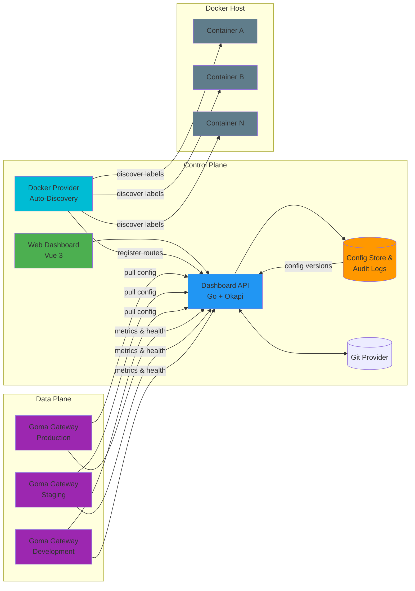

# Goma Admin

*Control Plane for Goma Gateway* — Manage, configure, and monitor distributed API gateways from a single, unified dashboard.

[](https://github.com/jkaninda/goma-admin/actions/workflows/ci.yml)
[](https://goreportcard.com/report/github.com/jkaninda/goma-admin)
[](https://go.dev/)
[](https://pkg.go.dev/github.com/jkaninda/goma-admin)
[](https://github.com/jkaninda/goma-admin/releases)


> **Warning**: This project is currently under active development. Contributions and feedback are welcome!

## Features

- **Multi-instance management** — configure routes and middlewares per gateway instance
- **File provider** — writes YAML config files that the gateway watches and hot-reloads
- **HTTP provider** — gateways pull config from the Admin API on a schedule
- **Docker provider** — auto-discovers services from `goma.*` container labels
- **Import / Export** — load and dump Goma-compatible YAML configs
- **Provider API** — instance-aware endpoints for gateways to pull config dynamically
- **API key management** — generate and manage keys for gateway-to-admin authentication
- **Real-time metrics** — scrapes Prometheus metrics from gateway instances
- **Health monitoring** — background polling of instance health endpoints
- **OAuth support** — pluggable OAuth2 providers (Keycloak, Gitea, etc.)
- **Audit log** — tracks every config change with before/after snapshots
- **Git sync** — bidirectional sync of instance configurations with Git repositories
- **Encryption** — encrypt sensitive configuration values at rest
- **OpenAPI docs** — auto-generated Swagger UI

## Screenshots

### Dashboard

<p align="center">
  
</p>

### Dashboard (Dark)

<p align="center">
  
</p>

## Architecture



### Components

**Control Plane:**
- **Web Dashboard**: Vue 3 based UI for configuration and monitoring
- **Dashboard API**: Go backend built with the Okapi framework
- **Config Store**: PostgreSQL database for configurations and audit logs
- **Docker Provider**: Polls the Docker daemon and auto-registers routes from container `goma.*` labels

**Data Plane:**
- **Goma Gateway Instances**: One or more gateways pulling configuration from the control plane

## Quick Start (Docker Compose)

The fastest way to try Goma Admin is with the provided Docker Compose example.

```bash
cd examples
cp .env.example .env
# Edit .env — at minimum, change GOMA_JWT_SECRET
docker compose up -d
```

This starts three services:

| Service | Description | Port |
|---|---|---|
| **goma-gateway** | API Gateway (data plane) | `80` / `443` |
| **goma-admin** | Control Plane dashboard + API | `9000` |
| **goma-postgres** | PostgreSQL database | internal |

Open `http://localhost:9000` and log in with the credentials from your `.env` file (default: `admin@example.com` / `Admin@1234`).

### How configuration reaches the gateway

Goma Admin and the gateway share a **providers** volume. When you create or update routes and middlewares in the dashboard, Goma Admin writes a `goma.yaml` file into the instance's subdirectory (e.g. `/etc/goma/providers/default/goma.yaml`). The gateway watches that directory and hot-reloads automatically — no restart required.

The example `goma.yml` shipped in the `examples/` directory configures the gateway to use the **file provider**:

```yaml
gateway:
  providers:
    file:
      enabled: true
      directory: /etc/goma/providers/default   # "default" instance
      watch: true
```

Alternatively you can use the **HTTP provider**, where the gateway polls the Admin API directly:

```yaml
gateway:
  providers:
    http:
      enabled: true
      endpoint: "http://goma-admin:9000/api/v1/provider/{instance_name}"
      interval: 60s
      timeout: 10s
      retryAttempts: 5
      retryDelay: 3s
      headers:
        Authorization: "${INSTANCE_API_KEY}"
```

### Provider API

Goma Gateways pull their configuration from these endpoints. All responses are instance-scoped — pass the instance name in the URL, or omit it to use the **default** instance.

| Method | Endpoint | Description |
|---|---|---|
| `GET` | `/api/v1/provider/{instance_name}` | Full config bundle (routes + middlewares) |
| `GET` | `/api/v1/provider/routes/{instance_name}` | Routes only |
| `GET` | `/api/v1/provider/middlewares/{instance_name}` | Middlewares only |

Gateways authenticate using an **API key** passed in the `Authorization` header. You can generate API keys from the dashboard under **API Keys**


### Enabling the Docker provider

To auto-discover routes from Docker container labels, set `GOMA_DOCKER_ENABLED=true` in your `.env` and make sure the Docker socket is mounted (it is by default in the example compose file):

```yaml
volumes:
  - /var/run/docker.sock:/var/run/docker.sock:ro
```

Then add `goma.*` labels to your application containers — see [Docker Labels Reference](#docker-labels-reference) below.

### Getting started steps

1. Create an **instance** in Goma Admin (a "default" instance is created automatically on first start)
2. Create or import routes and middlewares
3. Generate an **API key** (needed only for the HTTP provider)
4. Configure your gateway with the file or HTTP provider
5. The gateway starts receiving dynamic configuration

## Local Development

### Prerequisites

- Go 1.26+
- Node.js 20+ and npm
- PostgreSQL (or use `make dev` to start one in Docker)

### Setup

```bash
git clone https://github.com/jkaninda/goma-admin.git
cd goma-admin

cp .env.example .env          # edit with your local DB credentials

make dev                      # start PostgreSQL in Docker
make install                  # install frontend dependencies
make build-ui                 # build Vue 3 frontend
go run ./cmd                  # start the backend
```

The dashboard is available at `http://localhost:9000`.

## Configuration

### Database

| Variable | Description | Default |
|---|---|---|
| `GOMA_DB_HOST` | PostgreSQL host | `localhost` |
| `GOMA_DB_USER` | Database user | `goma` |
| `GOMA_DB_PASSWORD` | Database password | `goma` |
| `GOMA_DB_NAME` | Database name | `goma` |
| `GOMA_DB_PORT` | Database port | `5432` |
| `GOMA_DB_SSL_MODE` | SSL mode (`disable`, `require`) | `disable` |
| `GOMA_DB_URL` | Full database URL (overrides individual DB vars) | — |

### Server

| Variable | Description | Default |
|---|---|---|
| `GOMA_PORT` | HTTP server port | `9000` |
| `GOMA_ENVIRONMENT` | Environment (`development`, `production`) | `development` |
| `GOMA_LOG_LEVEL` | Log level (`debug`, `info`, `warn`, `error`) | `info` |
| `GOMA_ENABLE_DOCS` | Enable OpenAPI documentation | `true` |
| `GOMA_WEB_DIR` | Frontend assets directory | `web/dist` |
| `GOMA_PROVIDERS_DIR` | Directory for instance config output | `/etc/goma/providers` |
| `GOMA_BASE_URL` | Base URL for OAuth callbacks | `http://localhost:9000` |

### Security

| Variable | Description | Default |
|---|---|---|
| `GOMA_JWT_SECRET` | JWT signing secret (**change in production**) | `default-secret-key` |
| `GOMA_JWT_ISSUER` | JWT issuer claim | `goma-admin` |
| `GOMA_CORS_ALLOWED_ORIGINS` | CORS origins (comma-separated) | `*` |
| `GOMA_ADMIN_EMAIL` | Default admin email | `admin@example.com` |
| `GOMA_ADMIN_PASSWORD` | Default admin password | `Admin@1234` |

### Health Checker

| Variable | Description | Default |
|---|---|---|
| `GOMA_HEALTH_CHECK_ENABLED` | Enable background health polling | `true` |
| `GOMA_HEALTH_CHECK_INTERVAL` | Polling interval | `30s` |
| `GOMA_HEALTH_CHECK_TIMEOUT` | Health check timeout | `5s` |

### Docker Provider

| Variable | Description | Default |
|---|---|---|
| `GOMA_DOCKER_ENABLED` | Enable Docker provider | `false` |
| `GOMA_DOCKER_HOST` | Docker daemon socket | `unix:///var/run/docker.sock` |
| `GOMA_DOCKER_POLL_INTERVAL` | Container poll interval | `10s` |
| `GOMA_DOCKER_ENABLE_SWARM` | Enable Docker Swarm service discovery | `false` |

### Git Sync

| Variable | Description | Default |
|---|---|---|
| `GOMA_REPO_SYNC_ENABLED` | Enable Git repository sync | `true` |
| `GOMA_REPO_SYNC_INTERVAL` | Sync interval | `2m` |

When enabled, Goma Admin periodically syncs instance configurations to and from linked Git repositories. Configure repositories from the dashboard under **Repositories**.

### Encryption

| Variable | Description | Default |
|---|---|---|
| `GOMA_ENCRYPTION_KEY` | Key used to encrypt sensitive values at rest | Falls back to `GOMA_JWT_SECRET` |

Sensitive configuration values (e.g. OAuth client secrets) are encrypted before being stored in the database. If `GOMA_ENCRYPTION_KEY` is not set, the JWT secret is used as a fallback.

## Docker Labels Reference

### Single-Route Configuration

A container exposing **one route** can use flat `goma.*` labels.

```yaml
services:
  api-service:
    image: your-api:latest
    labels:
      # Core
      - "goma.enable=true"
      - "goma.name=api"
      - "goma.path=/api"
      - "goma.port=8000"
      - "goma.rewrite=/"
      - "goma.priority=100"

      # Hosts & Methods
      - "goma.hosts=api.example.com,api.local"
      - "goma.methods=GET,POST,PUT,DELETE"

      # Health Check
      - "goma.health_check.path=/health"
      - "goma.health_check.interval=30s"
      - "goma.health_check.timeout=5s"
      - "goma.health_check.healthy_statuses=200,204"

      # Security
      - "goma.security.forward_host_headers=true"
      - "goma.security.enable_exploit_protection=true"
      - "goma.security.tls.insecure_skip_verify=false"

      # Features
      - "goma.middlewares=jwt-auth,rate-limit"
      - "goma.disable_metrics=false"
```

### Multi-Route Configuration

If a container exposes **multiple ports or paths**, use the `goma.routes.{routeName}.*` pattern.

```yaml
services:
  multi-service:
    image: your-service:latest
    labels:
      - "goma.enable=true"

      # Route: API
      - "goma.routes.api.path=/api"
      - "goma.routes.api.port=8000"
      - "goma.routes.api.methods=GET,POST,PUT,DELETE"
      - "goma.routes.api.health_check.path=/health"
      - "goma.routes.api.health_check.interval=30s"
      - "goma.routes.api.security.forward_host_headers=true"

      # Route: Metrics
      - "goma.routes.metrics.path=/metrics"
      - "goma.routes.metrics.port=9090"
      - "goma.routes.metrics.methods=GET"
      - "goma.routes.metrics.disable_metrics=true"

      # Route: Admin
      - "goma.routes.admin.path=/admin"
      - "goma.routes.admin.port=8081"
      - "goma.routes.admin.hosts=admin.example.com"
      - "goma.routes.admin.security.enable_exploit_protection=true"
```

### Label Reference

#### Core

| Label | Description | Example |
|---|---|---|
| `goma.enable` | Enable route discovery | `true` |
| `goma.name` | Route name | `api` |
| `goma.path` | Public route path | `/api` |
| `goma.port` | Container port | `8080` |
| `goma.scheme` | Target scheme | `http` |
| `goma.rewrite` | Rewrite path | `/` |
| `goma.priority` | Route priority | `100` |
| `goma.enabled` | Enable/disable route | `true` |

#### Hosts & Methods

| Label | Description |
|---|---|
| `goma.hosts` | Allowed hostnames (comma-separated) |
| `goma.methods` | Allowed HTTP methods (comma-separated) |

#### Health Check

| Label | Description |
|---|---|
| `goma.health_check.path` | Health endpoint |
| `goma.health_check.interval` | Check interval |
| `goma.health_check.timeout` | Timeout |
| `goma.health_check.healthy_statuses` | Valid HTTP statuses |

#### Security

| Label | Description |
|---|---|
| `goma.security.forward_host_headers` | Forward original Host header |
| `goma.security.enable_exploit_protection` | Enable exploit protection |
| `goma.security.tls.insecure_skip_verify` | Skip TLS verification |

#### Features

| Label | Description |
|---|---|
| `goma.middlewares` | Attached middlewares (comma-separated) |
| `goma.disable_metrics` | Disable metrics for route |

#### Multi-Route Pattern

| Pattern | Description |
|---|---|
| `goma.routes.{name}.path` | Route path |
| `goma.routes.{name}.port` | Route port |
| `goma.routes.{name}.scheme` | Route scheme |
| `goma.routes.{name}.methods` | Allowed methods |
| `goma.routes.{name}.hosts` | Hosts |
| `goma.routes.{name}.health_check.*` | Health check |
| `goma.routes.{name}.security.*` | Security options |

## Contributing

Contributions are welcome! This project is in active development and needs help with:

- UI/UX improvements
- Test coverage
- Documentation
- Bug fixes
- New features

## Related Projects

- **[Goma Gateway](https://github.com/jkaninda/goma-gateway)** — Cloud-native API Gateway
- **[Goma HTTP Provider](https://github.com/jkaninda/goma-http-provider)** — HTTP provider specification
- **[Okapi](https://github.com/jkaninda/okapi)** — Go web framework

## License

This project is licensed under the MIT License — see the [LICENSE](LICENSE) file for details.

## Support

- Email: meAtjkaninda.dev
- LinkedIn: [LinkedIn](https://www.linkedin.com/in/jkaninda)

---

Copyright 2026 **Jonas Kaninda**
