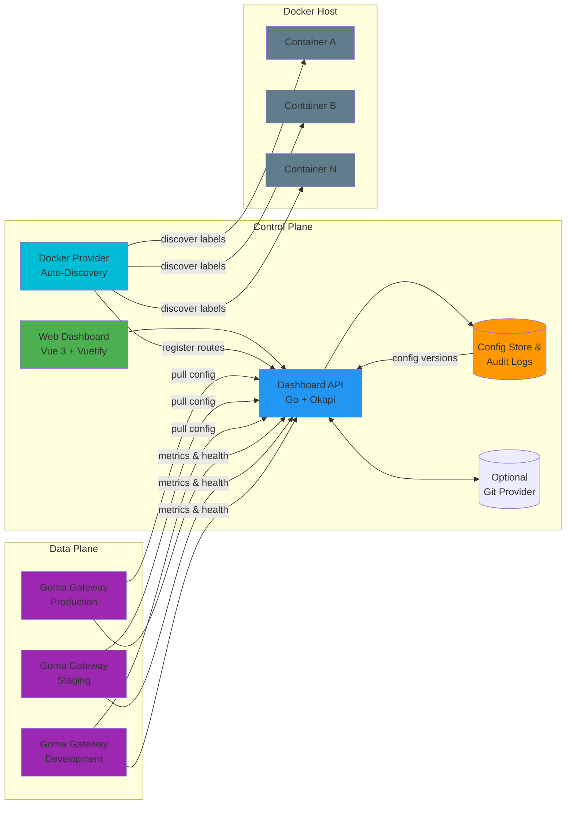

# Goma Admin

*Control Plane for Goma Gateway* — Manage, configure, and monitor distributed API gateways from a single, unified dashboard.

[](https://github.com/jkaninda/goma-admin/actions/workflows/ci.yml)
[](https://goreportcard.com/report/github.com/jkaninda/goma-admin)
[](https://go.dev/)
[](https://pkg.go.dev/github.com/jkaninda/goma-admin)
[](https://github.com/jkaninda/goma-admin/releases)


> **⚠️ Development Status**: This project is currently under active development. Contributions and feedback are welcome!

## Table of Contents

- [Overview](#overview)
- [Architecture](#architecture)
- [Getting Started](#getting-started)
- [Docker Deployment](#docker-deployment)
- [Configuration](#configuration)
- [Contributing](#contributing)
- [Related Projects](#related-projects)

## Overview

Goma Admin provides a centralized control plane for managing multiple Goma Gateway instances across different environments. It implements the [Goma Gateway HTTP Provider specification](https://github.com/jkaninda/goma-http-provider) to dynamically configure routes, middlewares, and monitor gateway health.

**Key Benefits:**
- Centralized configuration management for multiple gateway instances
- Visual interface for route and middleware configuration
- Real-time monitoring and analytics
- Configuration versioning with rollback capabilities
- Multi-environment support (dev, staging, production)


## Architecture




### Components

**Control Plane:**
- **Web Dashboard**: Vue3 based UI for configuration and monitoring
- **Dashboard API**: Go backend built with Okapi framework
- **Config Store**: Persistent storage for configurations and audit logs
- **Docker Provider**: Polls the Docker daemon and auto-registers routes from container `goma.*` labels

**Data Plane:**
- **Goma Gateway Instances**: Multiple gateway instances pulling configuration from the control plane


## Getting Started

### Prerequisites

- Go 1.26
- Node.js 18+ and npm/yarn


### Installation
```bash
# Clone the repository
git clone https://github.com/jkaninda/goma-admin.git
cd goma-admin

# Backend setup

cp .env.example .env
go run main.go

```

## Docker Deployment

Run Goma Admin with Docker Compose:

```bash
cd examples
cp .env.example .env
# Edit .env with your production values (at minimum, change GOMA_JWT_SECRET)
docker compose up -d
```

This starts three services:

| Service | Description | Port |
|---|---|---|
| **goma-gateway** | API Gateway (data plane) | `80` / `443` |
| **goma-admin** | Control Plane dashboard | `9000` |
| **goma-postgres** | PostgreSQL database | — |

Goma Admin and the gateway share a `providers` volume — configuration files written by the control plane are immediately available to the gateway.

Access the dashboard at `http://localhost:9000` and log in with the admin credentials from your `.env` file.

See the full [Docker deployment example](https://github.com/jkaninda/goma-admin/tree/main/examples) for details.

### Enabling the Docker Provider

To auto-discover routes from Docker container labels, uncomment the Docker socket mount in `compose.yml` and set `GOMA_DOCKER_ENABLED=true` in your `.env`:

```yaml
volumes:
  - /var/run/docker.sock:/var/run/docker.sock:ro
```

Then add `goma.*` labels to your application containers. See the example compose file for the full label reference.

## Configuration

### Database

| Variable | Description | Default |
|---|---|---|
| `GOMA_DB_HOST` | PostgreSQL host | `localhost` |
| `GOMA_DB_USER` | Database user | `goma` |
| `GOMA_DB_PASSWORD` | Database password | `goma` |
| `GOMA_DB_NAME` | Database name | `goma` |
| `GOMA_DB_PORT` | Database port | `5432` |
| `GOMA_DB_SSL_MODE` | SSL mode (`disable`, `require`) | `disable` |
| `GOMA_DB_URL` | Full database URL (overrides individual DB vars) | — |

### Server

| Variable | Description | Default |
|---|---|---|
| `GOMA_PORT` | HTTP server port | `9000` |
| `GOMA_ENVIRONMENT` | Environment (`development`, `production`) | `development` |
| `GOMA_LOG_LEVEL` | Log level (`debug`, `info`, `warn`, `error`) | `info` |
| `GOMA_ENABLE_DOCS` | Enable OpenAPI documentation | `true` |
| `GOMA_WEB_DIR` | Frontend assets directory | `web/dist` |
| `GOMA_PROVIDERS_DIR` | Directory for instance config output | `/etc/goma/providers` |
| `GOMA_BASE_URL` | Base URL for OAuth callbacks | `http://localhost:9000` |

### Security

| Variable | Description | Default |
|---|---|---|
| `GOMA_JWT_SECRET` | JWT signing secret (**change in production**) | `default-secret-key` |
| `GOMA_JWT_ISSUER` | JWT issuer claim | `goma-admin` |
| `GOMA_CORS_ALLOWED_ORIGINS` | CORS origins (comma-separated) | `*` |
| `GOMA_ADMIN_EMAIL` | Default admin email | `admin@example.com` |
| `GOMA_ADMIN_PASSWORD` | Default admin password | `Admin@1234` |

### Health Checker

| Variable | Description | Default |
|---|---|---|
| `GOMA_HEALTH_CHECK_ENABLED` | Enable background health polling | `true` |
| `GOMA_HEALTH_CHECK_INTERVAL` | Polling interval | `30s` |
| `GOMA_HEALTH_CHECK_TIMEOUT` | Health check timeout | `5s` |

### Docker Provider

| Variable | Description | Default |
|---|---|---|
| `GOMA_DOCKER_ENABLED` | Enable Docker provider | `false` |
| `GOMA_DOCKER_HOST` | Docker daemon socket | `unix:///var/run/docker.sock` |
| `GOMA_DOCKER_POLL_INTERVAL` | Container poll interval | `10s` |
| `GOMA_DOCKER_ENABLE_SWARM` | Enable Docker Swarm service discovery | `false` |

## Goma Gateway Configuration

Configure your Goma Gateway to use the HTTP provider:

```yaml
gateway:
  providers:
    http:
      enabled: true
      endpoint: "http://goma-admin:9000/api/v1/provider/{instance_name}"
      interval: 60s
      timeout: 10s
      retryAttempts: 5
      retryDelay: 3s
      headers:
        Authorization: "${INSTANCE_API_KEY}"
```

### Steps

1. Create an `instance` in Goma Admin
3. Create/Import routes & middlewares
3. Generate an `API key`
4. Configure your gateway with the HTTP provider
5. Start receiving dynamic configuration

## Screenshots

### Dashboard

<p align="center">
  
</p>

### Dashboard (Dark)

<p align="center">
  
</p>

### Instances

<p align="center">
  
</p>


## Contributing

Contributions are welcome! This project is in active development and needs help with:

- UI/UX improvements
- Test coverage
- Documentation
- Bug fixes
- New features


## Related Projects

- **[Goma Gateway](https://github.com/jkaninda/goma-gateway)** - Cloud-native API Gateway
- **[Goma HTTP Provider](https://github.com/jkaninda/goma-http-provider)** - HTTP provider specification
- **[Okapi](https://github.com/jkaninda/okapi)** - Go web framework


## License

This project is licensed under the MIT License - see the [LICENSE](LICENSE) file for details.

## Support

- Email: meAtjkaninda.dev
- LinkedIn: [LinkedIn](https://www.linkedin.com/in/jkaninda)

---

## © Copyright

© 2026  **Jonas Kaninda**
