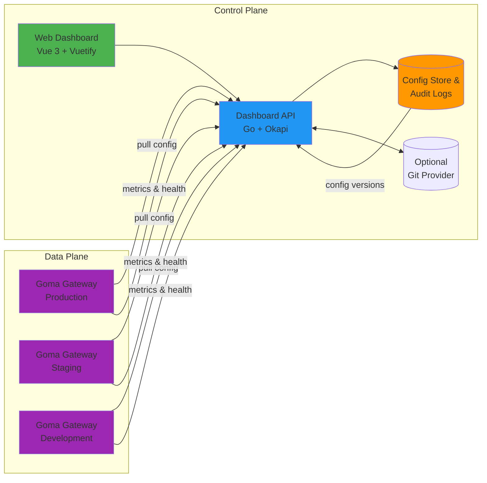

# Goma Admin

A comprehensive admin dashboard for managing Goma Gateway instances with visual configuration, real-time monitoring, and multi-environment support.

[](LICENSE)
[](go.mod)
[](package.json)

> **⚠️ Development Status**: This project is currently under active development. Contributions and feedback are welcome!

## Table of Contents

- [Overview](#overview)
- [Architecture](#architecture)
- [Getting Started](#getting-started)
- [Docker Deployment](#docker-deployment)
- [Configuration](#configuration)
- [Contributing](#contributing)
- [Related Projects](#related-projects)

## Overview

Goma Admin provides a centralized control plane for managing multiple Goma Gateway instances across different environments. It implements the [Goma Gateway HTTP Provider specification](https://github.com/jkaninda/goma-http-provider) to dynamically configure routes, middlewares, and monitor gateway health.

**Key Benefits:**
- Centralized configuration management for multiple gateway instances
- Visual interface for route and middleware configuration
- Real-time monitoring and analytics
- Configuration versioning with rollback capabilities
- Multi-environment support (dev, staging, production)


## Architecture


### Components

**Control Plane:**
- **Web Dashboard**: Vue3 based UI for configuration and monitoring
- **Dashboard API**: Go backend built with Okapi framework
- **Config Store**: Persistent storage for configurations and audit logs

**Data Plane:**
- **Goma Gateway Instances**: Multiple gateway instances pulling configuration from the control plane


## Getting Started

### Prerequisites

- Go 1.26
- Node.js 18+ and npm/yarn


### Installation
```bash
# Clone the repository
git clone https://github.com/jkaninda/goma-admin.git
cd goma-admin

# Backend setup

cp .env.example .env
go run main.go

```

## Docker Deployment

Run Goma Admin with Docker Compose:

```bash
cd examples/docker-deployment
cp .env.example .env
# Edit .env with your production values
docker compose up -d
```

This starts Goma Admin with PostgreSQL. Access the dashboard at `http://localhost:9000`.

See the full [Docker deployment example](examples/docker-deployment/) for details.

## Configuration

| Variable | Description | Default |
|---|---|---|
| `GOMA_DB_HOST` | PostgreSQL host | `localhost` |
| `GOMA_DB_USER` | Database user | `goma` |
| `GOMA_DB_PASSWORD` | Database password | `goma` |
| `GOMA_DB_NAME` | Database name | `goma` |
| `GOMA_DB_PORT` | Database port | `5432` |
| `GOMA_DB_SSL_MODE` | SSL mode (`disable`, `require`) | `disable` |
| `GOMA_DB_URL` | Full database URL (overrides individual DB vars) | — |
| `GOMA_PORT` | HTTP server port | `9000` |
| `GOMA_ENVIRONMENT` | Environment (`development`, `production`) | `development` |
| `GOMA_LOG_LEVEL` | Log level (`debug`, `info`, `warn`, `error`) | `info` |
| `GOMA_JWT_SECRET` | JWT signing secret | `default-secret-key` |
| `GOMA_JWT_ISSUER` | JWT issuer claim | `goma-admin` |
| `GOMA_CORS_ALLOWED_ORIGINS` | CORS origins (comma-separated) | `*` |
| `GOMA_ADMIN_EMAIL` | Default admin email | `admin@example.com` |
| `GOMA_ADMIN_PASSWORD` | Default admin password | `admin` |
| `GOMA_ENABLE_DOCS` | Enable OpenAPI documentation | `true` |
| `GOMA_WEB_DIR` | Frontend assets directory | `web/dist` |


## Contributing

Contributions are welcome! This project is in active development and needs help with:

- UI/UX improvements
- Test coverage
- Documentation
- Bug fixes
- New features

Please read [CONTRIBUTING.md](CONTRIBUTING.md) for details on our code of conduct and the process for submitting pull requests.

## Related Projects

- **[Goma Gateway](https://github.com/jkaninda/goma-gateway)** - Cloud-native API Gateway
- **[Goma HTTP Provider](https://github.com/jkaninda/goma-http-provider)** - HTTP provider specification
- **[Okapi](https://github.com/jkaninda/okapi)** - Go web framework


## License

This project is licensed under the MIT License - see the [LICENSE](LICENSE) file for details.

## Support

- Email: meAtjkaninda.com
- LinkedIn: [LinkedIn](https://www.linkedin.com/in/jkaninda)

---

**Made with ❤️ by [Jonas Kaninda](https://github.com/jkaninda)**